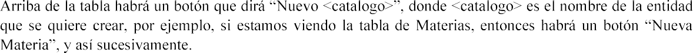
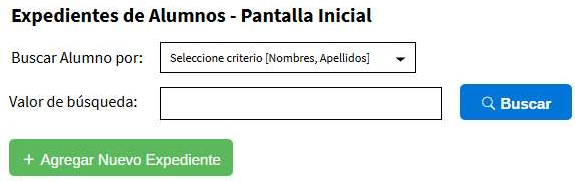
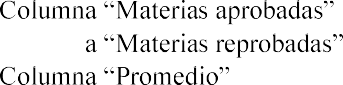

# Definicion

## Programación N-Capas, Ciclo 01/2020

Una institución educativa privada ha implementado un proyecto de estudiantes becados, con el objetivo de permitir a estudiantes que vienen de familias de escasos recursos estudiar en dicha institución. La junta directiva, ha pedido al Departamento de Informática de la Institución, que desarrolle un sistema computacional para la administración de dichos estudiantes. El sistema tendrá los siguientes componentes:

1. Componente de autenticación \(login\)
2. Componente de administración
3. Componente de procesos de negocio

## Actores \(roles\) del sistema:

1. Administrador
2. Coordinador

## Definición de los componentes

1. **Pantalla de autenticación**

**Roles: Administrador y Coordinador**

Este componente será el encargado de autenticar y autorizar a los usuarios del sistema. El sistema manejará dos roles: administrador y coordinador. Cada usuario solo puede estar asociado a un rol específico. La autenticación del sistema se hará mediante el ingreso de las credenciales de su cuenta \(nombre de usuario y su contraseña\), la cual ha sido registrada y activada previamente por parte del administrador, en el componente de administración. Un usuario no podrá ingresar al sistema si su cuenta se encuentra e  mostrando un mensaje advirtiendo de dicha causa.

El sistema no debe permitir que haya dos usuarios conectados al mismo tiempo \(doble inicio de sesión\). Esto

 que haya terminado su sesión \(haya salido del sistema\). Si el sistema detecta un doble inicio de sesión, le mostrará un mensaje al usuario advirtiendo la causa del error.

Habrá en la pantalla de inicio de sesión, un vínculo donde se pueda crear una nueva cuenta. La información de lo que debe llevar la cuenta se detalla en el punto número dos \(componente de administración\).

## Pantallas de administración Roles: Administrador

El componente de administración tendrá como objetivo administrar los distintos catálogos que el sistema manejará en el componente de procesos de negocio. Los catálogos que se utilizarán serán los siguientes:

* 1. Catálogo de Centros Escolares
  2. Catálogo de materias
  3. Catálogo de usuarios del sistema

Cada catalogo tendrá su propia pantalla en la que se podrán visualizar todos los registros que posee actualmente en formato de tabla, así como agregar y modificar registros  uno, sin embargo, no será posible eliminar registros. La información básica que contendrán será la llave primaria \(correlativo\), la descripción, estado \(activo o inactivo\). Cualquier otro campo que considere requerido queda a su criterio.

La tabla tendrá el siguiente formato:

| **Acción** | **Código** | **Descripción** | **Estado** |
| :--- | :--- | :--- | :--- |

, con el que se irá a editar el registro seleccionado.

El administrador será también el encargado de activar a los usuarios que hayan creado una nueva cuenta o inactivar aquellos que, por alguna razón, su cuenta deba ser desactivada.

Una cuenta tendrá la siguiente información: nombre, apellido, fecha de nacimiento, edad \(en años, calculada automáticamente a partir de la fecha de nacimiento\), departamento de residencia \(catálogo de departamento\), municipio de residencia \(catálogo de municipio\), dirección de residencia, estado \(activo o inactivo\), nombre de usuario, contraseña y tipo de usuario \(un selector si el usuario será Administrador o Coordinador\).

## Componente de procesos de negocio

**Roles: Coordinador. Solo el coordinador podrá tener acceso a estas pantallas, por lo que un usuario Administrador no podrá acceder \(se podrían ocultar los botones o enlaces de acceso\)**

Las pantallas serán las siguientes:

* 1. Expediente de Alumnos
  2. Información de materias cursadas

Al ingresar al componente de procesos, habrá dos vínculos donde el coordinador podrá acceder al subcomponente de expediente del alumno, o al subcomponente de materias cursadas.

## Pantalla Expedientes de alumnos

Esta pantalla tiene como objetivo, buscar, seleccionar, agregar o editar información del expediente de un alumno. La pantalla inicial permitirá buscar a los estudiantes por nombres y apellidos, habrá un combo box que permita seleccionar si se desea buscar por nombre o apellido   similar al siguiente prototipo:

Al dar clic al botón Buscar, se abrirá otra página que mostrará una tabla con los estudiantes que coincidan con los criterios ingresado. La tabla estará conformada por las siguientes columnas:

## Búsqueda de estudiantes

<table>
  <thead>
    <tr>
      <th style="text-align:left"><b>Acci&#xF3;n</b>
      </th>
      <th style="text-align:left"><b>Nombre</b>
      </th>
      <th style="text-align:left"><b>Apellido</b>
      </th>
      <th style="text-align:left">
        
<b>Materias</b>
        

        
<b>aprobadas</b>
        

      </th>
      <th style="text-align:left">
        
<b>Materias</b>
        

        
<b>reprobadas</b>
        

      </th>
      <th style="text-align:left"><b>Promedio</b>
      </th>
    </tr>
  </thead>
  <tbody></tbody>
</table>

para cada fila de la tabla, al dar clic al primer botón \(lupa\), mandará a la pantalla de edición 3.1.3 del expediente asociada al estudiante, en donde el coordinador podrá actualizar la información del estudiante si lo amerita. El segundo botón \(lápiz\) lo enviará a la pantalla de

6.0\) del estudiante. estudiante.

reprobadas \(cuya nota es menor a 6.0\) del

## Agregar nuevo expediente

* 1. lo redirigirá a una página donde podrá crear

un expediente de un nuevo estudiante. La información que se le pedirá ingresar será la siguiente:

* * * 1. Nombres
      2. Apellidos
      3. Número de carnet de minoridad \(9 caracteres alfanuméricos\)
      4. Fecha de nacimiento
      5. Edad \(En años, calculada automáticamente a partir de la fecha de nacimiento\)
      6. Dirección de vivienda
      7. Teléfono fijo
      8. Teléfono móvil
      9. Institución o centro escolar de procedencia \(solo se mostrarán los centros escolares del municipio seleccionado\)
      10. Nombre del padre
      11. Nombre de la madre

Todos los campos son de carácter obligatorio. Si algún campo se deja vacío, mostrará a la par un texto mencionando dicho problema \(El campo X no puede estar vacío\).

Al final de la página habrá tres botones guardar, limpiar y regresar. Al dar clic al botón Guardar se guardará el nuevo expediente y lo redirigirá de nuevo a la pantalla 3.1 

.

El botón Limpiar limpiará todos los campos con información ingresada. El botón Regresar hará que el sistema regrese a la pantalla 3.1.

## 3.1.3 Editar un expediente existente

 embargo, mostrará la información del estudiante que ha sido seleccionado desde los resultados de la búsqueda que el usuario realizo inicialmente. Se mostrará también los tres botones guardar, limpiar y regresar, sin embargo, el botón limpiar estará deshabilitado \(o se podría no mostrar\).

## Pantalla

Esta pantalla tendrá como objetivo asignar las materias que un estudiante ha cursado. La pantalla inicial mostrará un botón , el cual lo mandará a la pantalla 3.2.1 para **agregar** una nueva materia cursada, así como una tabla con las materias cursadas que se hayan ido agregando en el proceso 3.2.1 y tendrá las siguientes columnas:

| **Acción** | **Materia** | **Año** | **Ciclo** | **Nota** | **Resultado** |
| :--- | :--- | :--- | :--- | :--- | :--- |

La columna acción mostrará un botón , el cual lo enviará a la página 3.2.1 para **editar** la materia y cambiar cualquier campo ingresado.

a \(dependiendo de la nota\).

## Agregar o editar una materia cursada

Esta pantalla permitirá agregar o editar una materia cursada del estudiante seleccionado. Se ingresará al darle clic al botón . La pantalla constará de 3 partes. La primera, en la parte de arriba, mostrará el nombre del alumno al cual se le ingresará o editará la materia cursada. La segunda sección, parte de en medio, se ingresará la información de la materia cursada, la cual tendrá los siguientes campos: materia \(selector con los registros del catálogo de materias\), año \(desde el 2005 hasta la fecha\), ciclo

información de la nota cursada. Todos los campos son de carácter obligatorio, por lo que, si alguno se encuentra

## Ponderaciones

**Componente de autenticación \(10%\). Cada punto vale 2.5%**

* * * 1. Creación de nueva cuenta
      2. Validación de doble inicio de sesión
      3. Validación de cuentas inactivas
      4. Inicio de sesión

## Componente de administración \(10%\).

1. Pantalla de administración de catálogo de centros escolares \(5%\)
2. Pantalla de administración de catálogo de materias \(2.5%\)
3. Pantalla de administración de catálogo de usuarios del sistema \(2.5%\)

## Componente de procesos de negocio \(60%\)

1. Expediente de estudiante \(30%\). Cada punto vale 5%
   1. Búsqueda de estudiantes por nombre o apellido
   2. Agregar nuevo expediente
   3. Editar expediente ya existente d.

Column

e.

f.

1. Materias cursadas \(30%\). Cada punto vale 7.5%
   1. Encabezado con nombre del estudiante
   2. Agregar materia cursada
   3. Editar materia cursada
   4. Tabla con materias cursadas existentes para el estudiante **Uso de Bootstrap 4 para diseño y componentes visuales \(20%\) Tecnologías por utilizar en el desarrollo:**

El aplicativo se hará utilizando las siguientes tecnologías: Front-end:

1. HTML
2. JQuery
3. CSS
4. Bootstrap 4 Back-end:
5. Spring Framework MVC
6. Thymeleaf
7. JPA \(Hibernate\)
8. Spring Data
9. PostgreSQL 12 Java JDK 1.8

El desarrollo del aplicativo se hará en grupos con un máximo de 4 estudiantes.

## Forma de entrega:

El proyecto se entregará el día 7 de julio de 2020, enviando por correo electrónico al catedrático y a los instructores, el enlace del repositorio github junto con lo siguiente:

1. Backup de la base de datos \(ya debe venir poblada\)
2. Script de creación e inserts de la base de datos \(por si falla la restauración de la base, se pueda crear de forma programática\).
3. Archivo TXT con instrucciones para levantar el aplicativo \(puerto de PostgreSQL a utilizar en caso no fuera el por defecto, nombre que debe llevar la base de datos, usuarios, etc.\)
4. Archivo TXT con los integrantes del grupo

La base de datos ya debe venir con los registros necesarios para que el aplicativo pueda funcionar correctamente.

